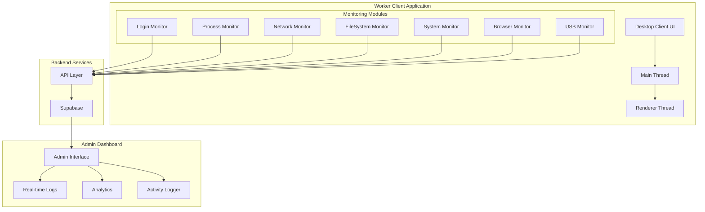

# Sentinel Worker Monitoring System

## Project Overview
Sentinel is a comprehensive worker monitoring solution designed for organizations to efficiently track and manage employee activities. The system consists of two main components:
1. A desktop client application that runs on workers' computers to collect monitoring data
2. An admin dashboard interface for supervisors to oversee worker activities and system metrics

## Architecture



## Technical Stack
- **Worker Client**: 
  - Electron.js (Desktop Application Framework)
  - TypeScript
  - HTML/CSS
  - Custom UI Components
- **Admin Dashboard**:
  - Web-based interface
  - Real-time monitoring capabilities
  - Analytics dashboard
- **Backend**:
  - Python monitoring modules
  - Supabase for data storage and real-time updates
  - Multi-threaded monitoring system

## Key Components

### 1. Worker Client Application (Desktop)
- Silent background monitoring
- System tray integration
- Minimal UI for worker awareness
- Automated data collection and reporting

### 2. Monitoring Modules (src/python)

| Monitor Type | Purpose | Admin Rights |
|-------------|---------|--------------|
| Login Monitor | Track worker login/logout times | Required |
| Process Monitor | Monitor application usage and productivity | Optional |
| Network Monitor | Track internet usage and website visits | Required |
| FileSystem Monitor | Monitor file operations and data handling | Optional |
| System Monitor | Track system resource usage | Required |
| Browser Monitor | Monitor web browsing activity | Required |
| USB Monitor | Track external device usage | Required |

### 3. Admin Dashboard
- Real-time worker activity monitoring
- Productivity analytics and reports
- Alert system for suspicious activities
- Team performance metrics
- User management
- Custom monitoring rules configuration

## Features

### Worker Monitoring
1. **Activity Tracking**
   - Application usage time
   - Productive vs non-productive time
   - Website access patterns
   - File system operations

2. **System Monitoring**
   - Resource utilization
   - Login/logout patterns
   - USB device usage
   - Network activity

3. **Productivity Metrics**
   - Time tracking
   - Application usage statistics
   - Task completion monitoring
   - Work pattern analysis

### Admin Features
1. **Real-time Dashboard**
   - Live worker status
   - Activity feeds
   - System alerts
   - Performance metrics

2. **Reporting Tools**
   - Productivity reports
   - Compliance monitoring
   - Resource utilization
   - Activity logs

3. **Management Tools**
   - User management
   - Department organization
   - Policy configuration
   - Alert settings

## Security and Privacy

### Data Collection
- Transparent monitoring policies
- Configurable monitoring rules
- Data retention policies
- GDPR compliance considerations

### Access Control
- Role-based access control
- Admin privilege management
- Data access logging
- Secure communication protocols

## Setup and Installation

### Worker Client Setup
1. Install Node.js dependencies:
   ```bash
   npm install
   ```

2. Install Python requirements:
   ```bash
   pip install -r requirements.txt
   ```

3. Configure monitoring settings:
   ```bash
   npm run configure
   ```

### Admin Dashboard Access
1. Admin credentials required
2. Web-based interface
3. Secure login system
4. Role assignment

## Project Structure
```
sentinel-app/
├── src/
│   ├── assets/          # Application assets
│   ├── main/           # Electron main process
│   ├── preload/        # Preload scripts
│   ├── python/         # Monitoring modules
│   ├── renderer/       # Worker client UI
│   │   ├── css/       # Stylesheets
│   │   ├── js/        # Frontend logic
│   │   └── types/     # TypeScript definitions
│   └── supabase/      # Database integration
├── build/             # Build output
└── logs/              # Activity logs
```

## Future Enhancements
- Advanced productivity analytics
- Machine learning for behavior analysis
